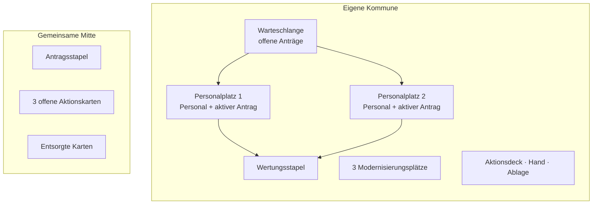
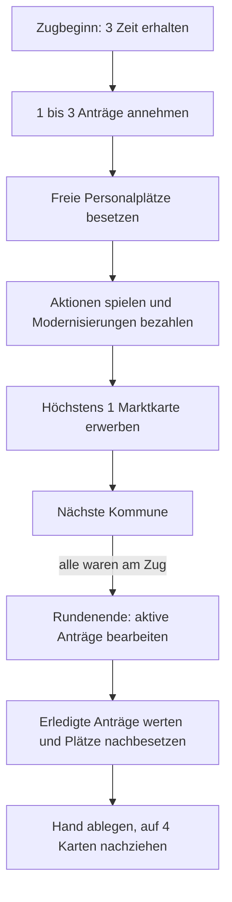

# AMTLICH! Das digitale Bürgeramt

## Spielkonzept v0.2: Zwei Schreibtische, drei Modernisierungen, ein wachsendes Aktionsdeck

**Genre:** kompetitives Deckbuilding mit schlankem Engine-Building und direkter Interaktion  
**Spielerzahl:** 2–4 Personen  
**Spieldauer:** 45–70 Minuten  
**Alter:** ab 12 Jahren  
**Prototypdauer:** 8 Runden  
**Ton:** humorvolle Verwaltungssatire, deren Pointe auf Abläufen, Technik und Organisation liegt

## 1. Kurzidee

Jede Person leitet das Bürgeramt einer fiktiven Kommune. Das Amt besitzt genau zwei dauerhaft besetzte Personalplätze und drei Plätze für Modernisierungen. Zu Spielbeginn werden zwei zufällige Beschäftigte zugeteilt. Ihre unterschiedlichen Arbeitsweisen bilden den strategischen Ausgangspunkt der Kommune.

In jedem Zug muss mindestens ein neuer Antrag angenommen werden. Weitere Anträge können freiwillig übernommen werden, um mehr Punkte zu erzielen. Ein Antrag wird entweder einem freien Beschäftigten zugewiesen oder wartet in der Warteschlange. Jeder neu zugewiesene Antrag beginnt grundsätzlich mit zwei Bearbeitungsmarken. Am Ende jeder Runde verliert jeder aktiv bearbeitete Antrag eine Marke. Sobald die letzte Marke entfernt wird, ist der Fall abgeschlossen und kommt als Punkt in den Wertungsstapel.

Personal, Modernisierungen und Aktionskarten verändern dieses einfache Zeitsystem. Wer schnell arbeitet, kann mehr Anträge annehmen. Wer zu viel verspricht, erzeugt eine lange Warteschlange und verliert am Spielende Punkte.

Der Deckbuilding-Anteil steckt vollständig in den Aktionskarten. Sie beschleunigen eigene Fälle, lösen organisatorische Probleme oder legen anderen Kommunen einen Störfall in die Akte. Eine gegen eine andere Kommune gespielte Karte wechselt nach Abschluss des betroffenen Antrags möglicherweise den Besitzer.

## 2. Die vier tragenden Entscheidungen

1. **Wie viele Anträge nehme ich an?** Einer ist Pflicht. Mehr bedeuten mehr mögliche Punkte, aber auch mehr Rückstau.
2. **Welcher Fall liegt bei welchem Beschäftigten?** Die beiden Personalprofile reagieren unterschiedlich auf Andrang, Störfälle und Modernisierungen.
3. **Nutze ich meine Zeit für den heutigen Betrieb oder für dauerhafte Verbesserungen?** Aktionen und Ausbau konkurrieren um dieselbe knappe Ressource.
4. **Spiele ich eine gute Aktionskarte selbst oder gebe ich sie als Störfall aus der Hand?** Ein Angriff kann dauerhaft im Deck der betroffenen Kommune landen.

## 3. Zentrale Begriffe und Ressourcen

| Begriff | Bedeutung |
| --- | --- |
| **Bearbeitungsmarke** | Noch benötigte Bearbeitungsdauer eines Antrags. Ein Standardantrag startet mit 2. |
| **Zeit** | Aktionsressource. Jede Kommune erhält zu Beginn ihres Zuges 3 Zeit. Nicht verbrauchte Zeit verfällt. |
| **Personalplatz** | Einer von zwei Schreibtischen. An jedem liegt höchstens ein aktiver Antrag. |
| **Warteschlange** | Alle angenommenen, aber noch keinem Personalplatz zugewiesenen Anträge. |
| **Modernisierungsplatz** | Einer von drei Plätzen für dauerhafte Upgrades aus Digitalisierung, Infrastruktur oder Schulung. |
| **Wertungsstapel** | Alle erledigten Anträge. Jeder Antrag ist 1 Punkt wert. |
| **Entsorgen** | Eine Karte kommt aus dem Spiel. Das ist nicht dasselbe wie der persönliche Ablagestapel. |

Es gibt im Grundspiel bewusst nur **eine auszugebende Ressource: Zeit**. Budget kann später als Expertenmodul ergänzt werden, falls der Ausbau zu wenig Konkurrenz erzeugt.

## 4. Material für den Papierprototyp

| Bestandteil | Anzahl | Anmerkung |
| --- | ---: | --- |
| Kommunentableaus | 4 | Je 2 Personal-, 3 Modernisierungsplätze, Warteschlange und Wertungsstapel |
| Personalkarten | 12 | Jeweils zwei werden zufällig pro Kommune verteilt |
| Persönliche Startdecks | 4 × 6 | Identische Aktionskarten |
| Weitere Aktionskarten | 48 | Gemeinsamer Markt, aufgeteilt in Hilfe, Organisation, Störfall und Reaktion |
| Antragskarten | 48 | Mechanisch identisch, ästhetisch unterschiedlich |
| Modernisierungskarten | 4 × 9 | Jede Kommune besitzt denselben persönlichen Ausbauvorrat |
| Bearbeitungsmarken | ca. 60 | Kleine neutrale Würfel oder Scheiben |
| Zeitmarker | 12 | Drei pro Kommune |
| Startspieler-Marker | 1 | Wechselt nach jeder Runde |
| Rundenzähler | 1 | Acht Runden |

## 5. Spielerbereich und zentrale Auslage

Die Modernisierungskarten liegen nicht im gemeinsamen Markt. Jede Kommune hat Zugriff auf denselben persönlichen Vorrat. Dadurch entsteht die Varianz durch das zufällige Personal und die Aktionsauslage, nicht durch das zufällige Vorenthalten eines notwendigen Upgrades.

## 6. Spielaufbau

1. Jede Person nimmt ein Kommunentableau, das persönliche Startdeck und den eigenen Modernisierungsvorrat.
2. Jede Person erhält zufällig zwei unterschiedliche Personalkarten und legt sie offen auf die beiden Personalplätze.
3. Für den ersten Test werden die Personalkarten vollständig zufällig verteilt. Für ein ausgeglicheneres Spiel kann später je eine Karte aus zwei unterschiedlich markierten Personalgruppen verteilt werden.
4. Jede Person mischt ihr sechs Karten starkes Startdeck und zieht vier Karten.
5. Drei Aktionskarten werden offen in die gemeinsame Auslage gelegt.
6. Alle Antragskarten werden gemischt und als verdeckter Stapel bereitgelegt.
7. Die Warteschlangen und Personalplätze beginnen ohne Anträge. Die Modernisierungsplätze sind leer.
8. Eine Startperson wird bestimmt. Das Spiel dauert acht Runden.

## 7. Runden- und Zugstruktur

Eine Runde besteht aus je einem Zug jeder Kommune und einer gemeinsamen Bearbeitungsphase.

### Phase A: Eigener Zug

#### 1. Zeit erhalten

Die aktive Kommune erhält **3 Zeit**. Restzeit aus der Vorrunde gibt es nicht.

#### 2. Anträge annehmen

Die aktive Kommune zieht **mindestens 1 und höchstens 3** Anträge.

- Freie Personalplätze werden sofort mit je einem neuen Antrag belegt.
- Alle übrigen Anträge kommen ans Ende der Warteschlange.
- Sind schon Anträge in der Warteschlange, werden freie Plätze zuerst mit den ältesten wartenden Fällen besetzt. Neu angenommene Fälle dürfen nicht vordrängeln.
- Jeder Antrag erhält bei seiner Zuweisung grundsätzlich **2 Bearbeitungsmarken**. Erst danach werden Personal- und Modernisierungseffekte angewendet.

#### 3. Aktionen und Modernisierung

Die aktive Kommune darf beliebig viele Handkarten spielen, solange sie deren Zeitkosten bezahlt. Sie darf außerdem Zeit auf genau eine noch nicht fertige Modernisierung legen.

- Eine ausgespielte eigene Hilfs-, Organisations- oder Reaktionskarte kommt anschließend auf die persönliche Ablage, sofern der Text nichts anderes sagt.
- Ein gegen eine andere Kommune gespielter Störfall wird an den betroffenen Antrag angelegt.
- Eine Modernisierung darf über mehrere Züge hinweg bezahlt werden. Sobald genügend Zeit auf ihr liegt, ist sie dauerhaft aktiv.
- Auch eine noch unfertige Modernisierung belegt bereits einen der drei Plätze.

#### 4. Aktionskarte erwerben

Die aktive Kommune darf **höchstens eine** der drei offenen Aktionskarten nehmen und offen auf die eigene Ablage legen. Der Erwerb selbst kostet keine Zeit. Die Kosten auf der Karte werden erst beim späteren Ausspielen bezahlt.

Am Ende des Zuges wird die Auslage wieder auf drei Karten aufgefüllt. So hat jede Person stets eine Auswahl, ohne dass ein einzelner Zug den gesamten Markt leerräumt.

### Phase B: Gemeinsames Rundenende

Nachdem alle Kommunen ihren Zug beendet haben:

1. Bei jedem aktiven Antrag wird geprüft, ob ein Effekt die normale Bearbeitung verhindert oder verändert.
2. Von jedem regulär bearbeiteten Antrag wird gleichzeitig **1 Bearbeitungsmarke** entfernt.
3. Jeder Antrag ohne Marken kommt in den Wertungsstapel seiner Kommune.
4. Angelegte Störfälle werden nach der unten beschriebenen Übergaberegel abgewickelt.
5. Freie Personalplätze werden in Reihenfolge aus der Warteschlange nachbesetzt. Diese neu zugewiesenen Fälle werden erst am Ende der nächsten Runde bearbeitet.
6. Alle legen übrige Handkarten ab und ziehen vier neue Karten. Ist das Deck leer, wird die persönliche Ablage gemischt.
7. Der Startspieler-Marker wandert im Uhrzeigersinn weiter.

## 8. Die Anträge

Alle Anträge sind mechanisch identisch:

- Sie beginnen mit 2 Bearbeitungsmarken.
- Sie benötigen genau einen Personalplatz.
- Sie sind nach Abschluss 1 Punkt wert.
- Sie besitzen keine Kategorien, Sonderregeln oder unterschiedlichen Belohnungen.

Die Unterschiede sind ausschließlich erzählerisch und grafisch. Beispiele:

| Titel | Reiner Flavor-Text |
| --- | --- |
| Personalausweis nach Umzug | „Die Kartons sind noch nicht ausgepackt, der Termin stand aber schon.“ |
| Reisepass für die Hochzeitsreise | „Abflug in sechs Wochen. Eigentlich reichlich Zeit.“ |
| PIN der Online-Ausweisfunktion | „Der Brief liegt bestimmt in irgendeiner Schublade.“ |
| Kinderreisepass abgelaufen | „Das Urlaubsfoto war überzeugender als der Blick in den Kalender.“ |
| Verlustanzeige | „Vielleicht taucht das Portemonnaie direkt nach dem Termin wieder auf.“ |
| Neue Namensführung | „Alle Unterlagen sind da. Nur nicht in derselben Reihenfolge.“ |

Die Karten dürfen unterschiedliche Menschen und Lebenslagen zeigen, aber keine davon darf mechanisch als „schwieriger Mensch“ markiert werden. Komplikationen entstehen ausschließlich durch Aktionskarten.

### Zeitpunkt von Markenänderungen

Damit Effekte eindeutig bleiben, gelten vier Regeln:

1. Ein Antrag kann nie weniger als 0 Marken haben.
2. Wird die letzte Marke während eines Zuges entfernt, bleibt der Antrag bis zum gemeinsamen Rundenende am Personalplatz und wird dann abgeschlossen.
3. Ein Effekt, der „bei Zuweisung“ gilt, wird nur einmal angewendet, wenn der Antrag auf einen Personalplatz kommt.
4. Wird ein Antrag zwischen Personalplätzen verschoben, gilt das nicht als neue Zuweisung, außer eine Karte sagt ausdrücklich etwas anderes.

## 9. Personal als fester strategischer Kern

Personal wird nicht ins Deck gemischt und nicht jede Runde neu ausgespielt. Die beiden zufällig zugeteilten Karten bleiben für die gesamte Partie offen auf dem Tableau. Jede besitzt genau eine klar erkennbare Stärke.

### Beispielpersonal

| Personal | Dauerhafte Fähigkeit |
| --- | --- |
| **Aylin Demir, Digital-Lotsin** | Sobald eine Digitalisierung aktiv ist, startet der erste ihr pro Runde zugewiesene Antrag mit 1 Marke weniger. |
| **Bernd Peters, Publikumsliebling** | Ein fremder Störfall gegen seinen Antrag kostet die ausspielende Kommune 1 zusätzliche Zeit. |
| **Claudia Reuter, Dienst nach Vorschrift** | Der erste Störfall an ihrem Antrag darf höchstens 1 zusätzliche Marke verursachen und keine Bearbeitungsphase überspringen lassen. |
| **Darius Wolf, Fortbildungsfan** | Die erste Schulung an seinem Personalplatz kostet insgesamt 2 Zeit weniger. |
| **Eleni Papadakis, Improvisationstalent** | Einmal pro Runde darfst du die aktiven Anträge deiner beiden Personalplätze tauschen. |
| **Frank Neumann, Ruhepol** | Bei 3 oder mehr wartenden Anträgen sind eigene positive Aktionen auf seinen Antrag 1 Zeit günstiger, mindestens 0. |
| **Gül Kaya, Triage-Profi** | Bei 3 oder mehr wartenden Anträgen startet der nächste ihr zugewiesene Antrag mit 1 Marke weniger. |
| **Hannes Vogt, Gründlicher Prüfer** | Negative Aktionen können keine bereits entfernte Marke auf seinen Antrag zurücklegen. Sie dürfen die normale Bearbeitung aber weiterhin verhindern. |
| **Isabel König, Springerin** | Einmal pro Runde darf ein aktiver Antrag auf einen gerade frei gewordenen Personalplatz verschoben werden. |
| **Jonas Weber, Prozessdenker** | Die erste Infrastruktur, die seinen Antrag betrifft, darf einmal pro Runde ein zweites Mal auslösen. |
| **Karla Nguyen, Teamcoach** | Einmal pro Runde darf eine positive Aktion statt auf ihren Antrag auf den Antrag des anderen Personalplatzes wirken. |
| **Mehmet Yilmaz, Routinier** | Hat sein Antrag keinen angelegten Störfall, wird an jedem zweiten Rundenende 1 zusätzliche Marke entfernt. |

Für den ersten Test sollten alle Personalprofile ungefähr **zwei bis drei zusätzliche Abschlüsse über eine ganze Partie ermöglichen oder verhindern**, aber nur bei passender Spielweise. Kein Profil darf immer besser sein als ein anderes.

## 10. Warteschlange und Andrang

Die Warteschlange soll taktisch spürbar sein, ohne eine zusätzliche Verwaltungsrechnung zu erzeugen.

### Drei Zustände

| Wartende Anträge | Zustand | Allgemeine Wirkung |
| ---: | --- | --- |
| 0–2 | **Normalbetrieb** | Keine allgemeine Änderung |
| 3–4 | **Andrang** | Fremde Störfälle gegen dich kosten 1 zusätzliche Zeit |
| 5+ | **Überlastung** | Wie Andrang; zusätzlich kostet deine erste positive Aktion pro Zug 1 Zeit weniger |

Diese Staffelung erzeugt einen kleinen Aufholmechanismus. Eine volle Warteschlange bleibt wegen der Schlusswertung gefährlich, macht die betroffene Kommune aber weniger attraktiv als Angriffsziel und schaltet bestimmte Personalprofile frei.

Zusätzlich besitzen einzelne Personal- und Aktionskarten das Schlüsselwort **Andrang**. Sie werden bei mindestens drei wartenden Anträgen besser. So kann ein Spieler mit Triage-Personal bewusst aggressiver Anträge annehmen, während ein auf Ruhe und Automatisierung ausgerichtetes Amt die Schlange möglichst kurz hält.

### Schlussmalus

Am Spielende gibt es **−1 Punkt je zwei nicht erledigte Anträge**, aufgerundet. Aktive Anträge und Warteschlange zählen gemeinsam.

Beispiele:

- 1 offener Antrag: −1 Punkt
- 2 offene Anträge: −1 Punkt
- 3 offene Anträge: −2 Punkte
- 6 offene Anträge: −3 Punkte

Damit ist das freiwillige Annehmen zusätzlicher Anträge eine echte Wette auf die eigene Kapazität.

## 11. Modernisierungen

Jede Kommune besitzt drei Plätze. Modernisierungen kommen nicht ins Aktionsdeck und bleiben nach Fertigstellung dauerhaft aktiv. Eine begonnene Modernisierung darf nicht kostenlos ersetzt werden. Wer einen Platz räumt, entsorgt die alte Karte und alle darauf investierte Zeit.

### Digitalisierung

| Upgrade | Zeitkosten | Dauerhafter Effekt |
| --- | ---: | --- |
| **Digitale Antragsvorbereitung** | 5 | Der erste pro Runde zugewiesene Antrag startet mit 1 Marke weniger. |
| **Registerschnittstelle** | 4 | Einmal pro Runde darfst du das Hinzufügen einer Marke durch einen Störfall verhindern. |
| **Automatisierte Terminprüfung** | 3 | Wenn du in deinem Zug nur den Pflichtantrag annimmst, ziehe danach 1 Aktionskarte und lege 1 Handkarte ab. |

### Infrastruktur

| Upgrade | Zeitkosten | Dauerhafter Effekt |
| --- | ---: | --- |
| **Modernes Lichtbildterminal** | 4 | Die erste positive Aktion auf einen aktiven Antrag kostet pro Runde 1 Zeit weniger. |
| **Ausweicharbeitsplatz** | 5 | Einmal pro Partie darf ein dritter Antrag für eine Runde aktiv bearbeitet werden. |
| **Online-Terminmanagement** | 3 | Für die Zustände Andrang und Überlastung wird deine Warteschlange behandelt, als enthielte sie 1 Antrag weniger. Der Schlussmalus bleibt unverändert. |

### Schulung

Eine Schulung wird beim Bau einem der beiden Personalplätze zugeordnet, belegt aber einen normalen Modernisierungsplatz.

| Upgrade | Zeitkosten | Dauerhafter Effekt |
| --- | ---: | --- |
| **Fachverfahren kompakt** | 3 | Einmal pro Runde darfst du 1 Zeit weniger für eine Aktion auf den zugeordneten Antrag bezahlen. |
| **Umgang mit Sonderfällen** | 4 | Der erste Störfall pro Runde auf den zugeordneten Antrag verliert einen Nebeneffekt; reine Markenänderungen bleiben bestehen. |
| **Arbeitsorganisation und Triage** | 4 | Bei Andrang darfst du nach Abschluss eines Antrags sofort den nächsten Fall zuweisen und 1 Marke entfernen. |

### Ausbaugrenze

Ein Ausbauplatz mit unfertigem Upgrade ist blockiert. Das macht die Zeitinvestition verbindlich und verhindert, dass Spieler folgenlos zwischen Projekten wechseln. Für einen ersten Test sind reine Zeitkosten vorzuziehen. Ein späteres Budgetmodul könnte starke Upgrades zusätzlich mit Geldkosten versehen.

## 12. Das Aktionsdeck

Jede Kommune beginnt mit sechs einfachen Karten und zieht pro Runde vier. Karten besitzen einen Zeitpreis von 0 bis 3. Stärkere Effekte kosten mehr Zeit oder geben die Karte dauerhaft an eine andere Kommune ab.

### Startdeck jeder Kommune

| Anzahl | Karte | Kosten | Effekt |
| ---: | --- | ---: | --- |
| 2 | **Routinegriff** | 1 | Entferne 1 Marke von einem eigenen aktiven Antrag. |
| 1 | **Kollegiale Rückfrage** | 0 | Ziehe 1 Karte, lege danach 1 Karte ab. |
| 1 | **Priorisieren** | 1 | Tausche einen aktiven Antrag mit dem ersten Antrag deiner Warteschlange. |
| 1 | **Rückruf vereinbart** | 1 | Verhindere, dass diese Runde 1 Marke auf einen eigenen Antrag gelegt wird. |
| 1 | **Unklare Zuständigkeit** | 2 | Störfall: Lege 1 Marke auf einen fremden aktiven Antrag. |

### Kartenarten

| Art | Ziel und Verwendung |
| --- | --- |
| **Hilfe** | Beschleunigt einen eigenen aktiven Antrag oder schützt ihn. |
| **Organisation** | Verändert Warteschlange, Kartenziehen, Zuweisung oder Modernisierung. |
| **Störfall** | Wird an einen fremden aktiven Antrag gelegt und wechselt eventuell den Besitzer. |
| **Reaktion** | Wird als Antwort auf einen fremden Effekt gespielt; die Zeit wird sofort aus dem eigenen Vorrat bezahlt. |

### Beispielkarten für den Markt

| Karte | Art | Kosten | Effekt |
| --- | --- | ---: | --- |
| **Vollständige Unterlagen** | Hilfe | 1 | Entferne 1 Marke. Bei Normalbetrieb kostet diese Karte 0. |
| **Medienbruch überbrückt** | Hilfe | 2 | Entferne 1 Marke und entsorge anschließend einen Störfall an diesem Antrag. |
| **Kollegiale Amtshilfe** | Hilfe | 1 | Entferne je 1 Marke von zwei verschiedenen eigenen Anträgen. Danach ziehst du nächste Runde 1 Karte weniger. |
| **Tagesplan neu sortiert** | Organisation | 0 | Tausche die beiden aktiven Anträge oder einen aktiven mit dem ersten wartenden Antrag. |
| **Projektgruppe Digitalisierung** | Organisation | 2 | Lege sofort 2 Zeit auf eine begonnene Modernisierung. |
| **Aktenbereinigung** | Organisation | 2 | Entsorge diese Karte und eine weitere Karte aus deiner Hand oder Ablage. |
| **Kurzfristiger Terminausfall** | Störfall | 1 | Der betroffene Antrag verliert am nächsten Rundenende keine Marke. |
| **Lichtbild nicht abrufbar** | Störfall | 2 | Lege 1 Marke auf den betroffenen Antrag. |
| **Rückfrage der Fachstelle** | Störfall | 2 | Lege 1 Marke auf den Antrag. Sein Personaltext ist bis zum Rundenende inaktiv. |
| **Fachverfahren nicht erreichbar** | Störfall | 3 | Der Antrag wird diese Runde nicht regulär bearbeitet. Diese Karte darf nicht auf einen Antrag mit nur 1 Marke gespielt werden. |
| **Doch zuständig** | Reaktion | 1 | Neutralisiere einen gerade gespielten Störfall. Die Störfallkarte bleibt beim ursprünglichen Besitzer und geht auf dessen Ablage. |
| **Pragmatische Zwischenlösung** | Reaktion | 1 | Ein Effekt, der Bearbeitung verhindert, legt stattdessen genau 1 Marke auf den Antrag. |

## 13. Übergabe fremder Aktionskarten

Ein gegen eine andere Kommune gespielter Störfall wird unter den betroffenen Antrag geschoben. Die ausspielende Kommune gibt damit den Besitz der Karte zunächst auf.

Wenn der betroffene Antrag abgeschlossen wird, entscheidet die betroffene Kommune für jede angelegte fremde Karte:

- **Lerneffekt:** Die Karte kommt offen auf die eigene Ablage und gehört ab jetzt zum eigenen Deck.
- **Fall abgeschlossen:** Die Karte wird entsorgt und kommt aus der Partie.

Dadurch ist ein Angriff kein kostenloser Dauereffekt. Die angreifende Kommune verliert die Karte, während die betroffene Kommune entscheiden kann, ob sie den Störfall später selbst einsetzen möchte. Neutralisierte Störfälle wechseln nicht den Besitzer, sofern der Reaktionstext nichts anderes sagt.

### Begrenzungen

- An einem Antrag dürfen höchstens **zwei fremde Störfälle** gleichzeitig liegen.
- Derselbe Störfall darf nicht zweimal im selben Zug an denselben Antrag gelegt werden.
- Ein Antrag darf durch einen einzelnen Karteneffekt höchstens 1 zusätzliche Marke erhalten.
- Ein Antrag darf höchstens 4 Marken besitzen.
- Gegen eine Kommune im Zustand Andrang oder Überlastung kostet jeder Störfall 1 zusätzliche Zeit.

Diese Regeln verhindern Endlosschleifen und konzentrierte Angriffe, ohne die direkte Interaktion zu entfernen.

## 14. Kartendesign für den Prototyp

### Aktionskarte

| Bereich | Inhalt |
| --- | --- |
| Kopf links | Kartenart: Hilfe, Organisation, Störfall oder Reaktion |
| Kopf rechts | Zeitkosten, groß und klar |
| Bildmitte | Humorvolle Szene aus dem Verwaltungsalltag |
| Textfeld | Ein Effekt in höchstens zwei Sätzen |
| Fußzeile | Schlüsselwort wie **Andrang**, **Digital** oder **Einmalig** |

**Beispiel:**

| **LICHTBILD NICHT ABRUFBAR** | **2 Zeit** |
| --- | ---: |
| *Störfall* | Lege 1 Bearbeitungsmarke auf einen fremden aktiven Antrag. |
| **Übergabe** | Nach Abschluss darf die betroffene Kommune diese Karte in ihr Deck aufnehmen oder entsorgen. |

### Personalkarte

| Bereich | Inhalt |
| --- | --- |
| Kopf | Name und Arbeitsstil |
| Porträt | Wiedererkennbare, sympathische Figur |
| Fähigkeit | Genau eine dauerhafte Regel |
| Erinnerung | Symbol für bevorzugte Modernisierungsart oder Warteschlangen-Schwelle |

**Beispiel:**

| **GÜL KAYA** | **Triage-Profi** |
| --- | --- |
| *Dauerhaft* | Bei mindestens 3 wartenden Anträgen startet der nächste ihr zugewiesene Antrag mit 1 Marke weniger. |
| *Synergie* | Andrang · Arbeitsorganisation |

### Antragskarte

| **PERSONALAUSWEIS NACH UMZUG** | **1 Punkt** |
| --- | ---: |
| Illustration | Eine Person mit Umzugskarton und Terminbestätigung |
| Start | 2 Bearbeitungsmarken nach Zuweisung |
| Flavor | „Die Kartons sind noch nicht ausgepackt, der Termin stand aber schon.“ |

## 15. Beispielrunde

Die Kommune **Bad Formular** besitzt **Gül Kaya, Triage-Profi** und **Bernd Peters, Publikumsliebling**. In ihrer Warteschlange liegen bereits drei Anträge.

1. Zu Beginn des Zuges erhält Bad Formular 3 Zeit und nimmt den verpflichtenden neuen Antrag an.
2. Bei Gül ist gerade ein Platz frei. Wegen Andrang wird der älteste wartende Antrag zugewiesen. Er startet mit 2 Marken. Güls Fähigkeit reduziert ihn auf 1.
3. Bad Formular spielt für 1 Zeit **Routinegriff** und entfernt die letzte Marke. Der Antrag bleibt bis zum Rundenende auf dem Platz.
4. Eine andere Kommune möchte **Lichtbild nicht abrufbar** auf Bernds Antrag spielen. Die Karte kostet normalerweise 2 Zeit. Wegen Bernds Fähigkeit und des allgemeinen Andrangsschutzes kostet sie nun 4 Zeit und kann in diesem Zug nicht bezahlt werden.
5. Bad Formular investiert die restlichen 2 Zeit in **Arbeitsorganisation und Triage**. Es fehlen noch 2 Zeit bis zur Aktivierung.
6. Die Kommune nimmt kostenlos eine Karte aus dem Aktionsmarkt und legt sie auf ihre Ablage.
7. Am gemeinsamen Rundenende kommt Güls Antrag in den Wertungsstapel. Der Antrag bei Bernd verliert regulär 1 Marke. Güls Platz wird mit dem nächsten wartenden Fall besetzt, der erst in der folgenden Runde bearbeitet wird.

Die Runde zeigt die gewünschte Verzahnung: Das Personal bleibt greifbar, der Andrang beeinflusst Entscheidungen, die Marke bildet Bearbeitungsdauer ab und dieselben drei Zeitpunkte konkurrieren zwischen Soforthilfe und langfristigem Ausbau.

## 16. Spielende und Wertung

Nach der Bearbeitungsphase der achten Runde endet das Spiel.

1. Jeder erledigte Antrag im Wertungsstapel ist **1 Punkt** wert.
2. Je zwei noch offene Anträge kosten **1 Punkt**, aufgerundet.
3. Optional für spätere Tests: Jede vollständig aktivierte Modernisierung ist 1 Punkt wert. Im ersten Test sollte dieser Bonus fehlen, damit sich Upgrades durch ihre Wirkung rechtfertigen müssen.
4. Die Kommune mit den meisten Punkten gewinnt.
5. Bei Gleichstand gewinnt die Kommune mit weniger offenen Anträgen, danach mit weniger Karten im Deck.

## 17. Empfohlene Prototypwerte

| Stellschraube | Startwert |
| --- | ---: |
| Runden | 8 |
| Zeit pro Zug | 3 |
| Pflichtannahme | 1 Antrag |
| Maximale Annahme | 3 Anträge |
| Startmarken pro Antrag | 2 |
| Personalplätze | 2 |
| Modernisierungsplätze | 3 |
| Karten auf der Hand | 4 |
| Offene Marktkarten | 3 |
| Erwerb pro Zug | höchstens 1 |
| Maximalmarken pro Antrag | 4 |
| Störfälle pro Antrag | höchstens 2 |

## 18. Warum diese Version einfacher ist

- Es gibt keine unterschiedlichen Arbeits-, Beratungs- oder Digitalsymbole mehr.
- Jeder Antrag folgt derselben Regel: zwei Marken hinein, am Rundenende eine Marke herunter, bei null ein Punkt.
- Personal ist kein flüchtiger Handkarteneffekt, sondern die dauerhafte Identität der Kommune.
- Alle kurzfristigen Sonderregeln sitzen im Aktionsdeck.
- Nur drei Zeitpunkte müssen pro Zug verteilt werden.
- Die drei Ausbauplätze zeigen den Stand der Modernisierung unmittelbar auf dem Tableau.
- Die Warteschlange ist durch drei klar benannte Schwellen sichtbar, ohne für jeden Antrag Wartezeit einzeln zu zählen.

## 19. Kritische Fragen für den ersten Playtest

1. Ist das freiwillige Annehmen eines zweiten oder dritten Antrags verlockend genug?
2. Erzeugen 3 Zeit pro Zug einen spürbaren Konflikt zwischen Aktion und Modernisierung?
3. Sind Personalpaarungen unterschiedlich, aber ungefähr gleich stark?
4. Ist Andrang als Schutz und Synergie interessant, oder fühlt er sich wie eine Belohnung für schlechte Planung an?
5. Wechseln genug Störfallkarten den Besitzer, damit die Regel erinnerungswürdig ist?
6. Werden aggressive Karten tatsächlich gespielt, obwohl man sie dauerhaft abgibt?
7. Ist eine kostenlose Marktkarte pro Zug zu großzügig?
8. Kommen gekaufte Karten in acht Runden oft genug auf die Hand?
9. Sind vier Handkarten übersichtlich, oder braucht das Deckbuilding fünf?
10. Reicht der Schlussmalus, um maßloses Annehmen von Anträgen zu verhindern?

## 20. Varianten für spätere Tests

Diese Elemente sollten erst ergänzt werden, wenn der Grundablauf funktioniert:

- **Kommunalziele:** asymmetrische Zusatzaufgaben, etwa kurze Warteschlange oder drei verschiedene Modernisierungsarten.
- **Budget:** zweite Ressource für besonders starke Infrastruktur.
- **Personal-Draft:** Aus drei Personen zwei auswählen, statt vollständig zufällig zu verteilen.
- **Fortgeschrittene Anträge:** höchstens 20 % der Karten erhalten eine kleine Sonderregel. Das widerspricht bewusst dem Grundsatz des Basisspiels und sollte nur getestet werden, wenn die ästhetische Gleichheit zu flach wirkt.
- **Kooperation:** Amtshilfe zwischen Kommunen gegen Zeit oder zukünftige Gegenleistung.
- **Solo-Modus:** Eine automatische Landesprüfung erhöht jede Runde den Annahmedruck.

## 21. Minimaler Testumfang

Für die erste Partie genügen:

- 4 Kommunentableaus aus Papier,
- 8 zufällig gewählte Personalkarten,
- 24 identische Anträge,
- 4 identische Startdecks mit je 6 Karten,
- 24 unterschiedliche Marktkarten,
- je 9 handgeschriebene Modernisierungskarten pro Kommune,
- kleine Würfel als Bearbeitungsmarken und Münzen als Zeit.

Der wichtigste erste Test ist nicht die Feinbalance einzelner Karten, sondern der Durchsatz: Wie viele Anträge schafft eine normale Kommune, wie viele eine gut modernisierte, und ab wann kippt freiwillige Annahme in einen gefährlichen Rückstau?
